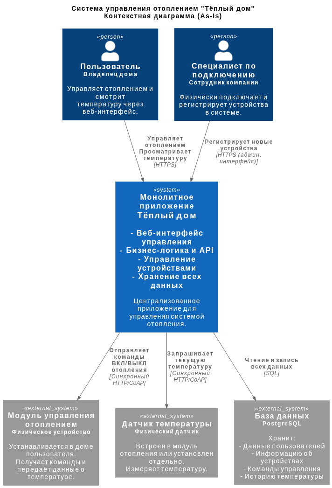
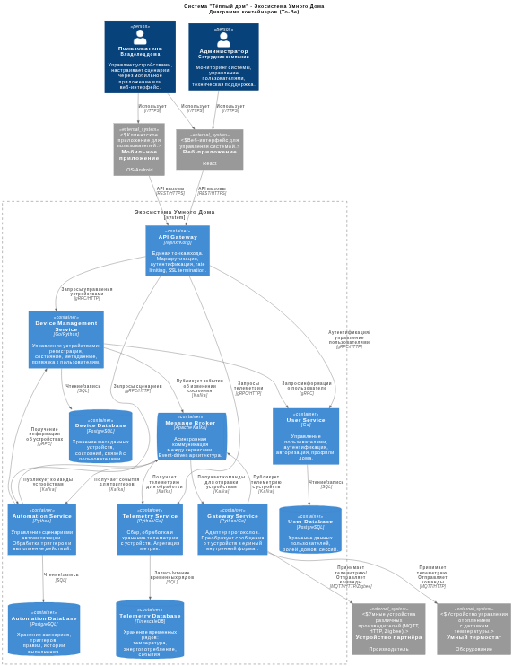
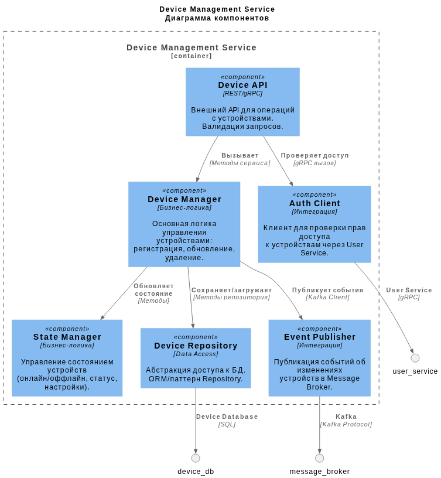
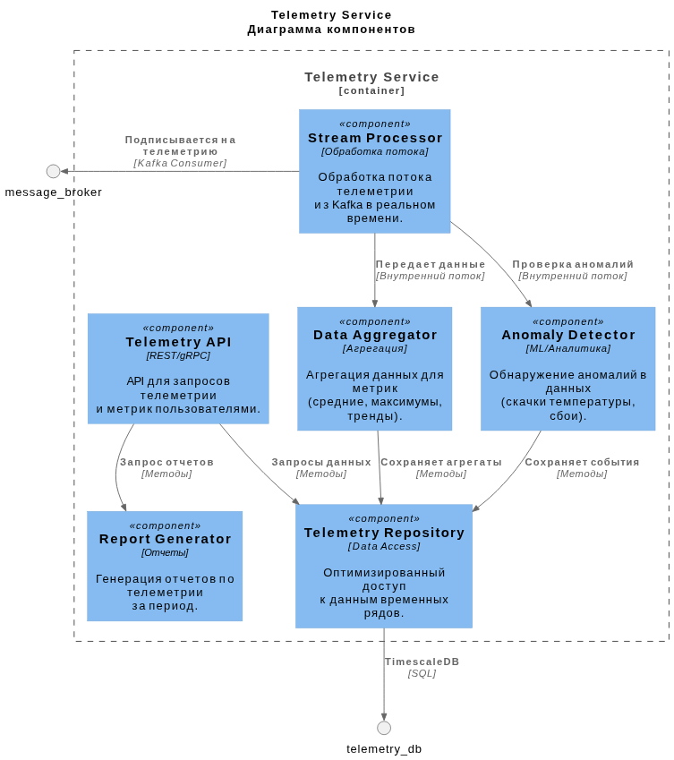
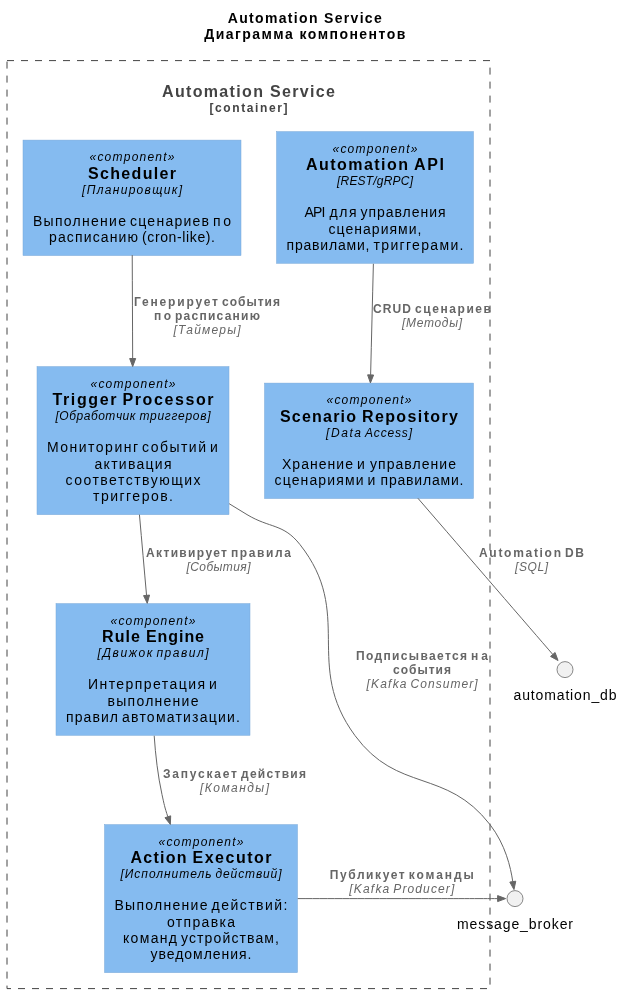
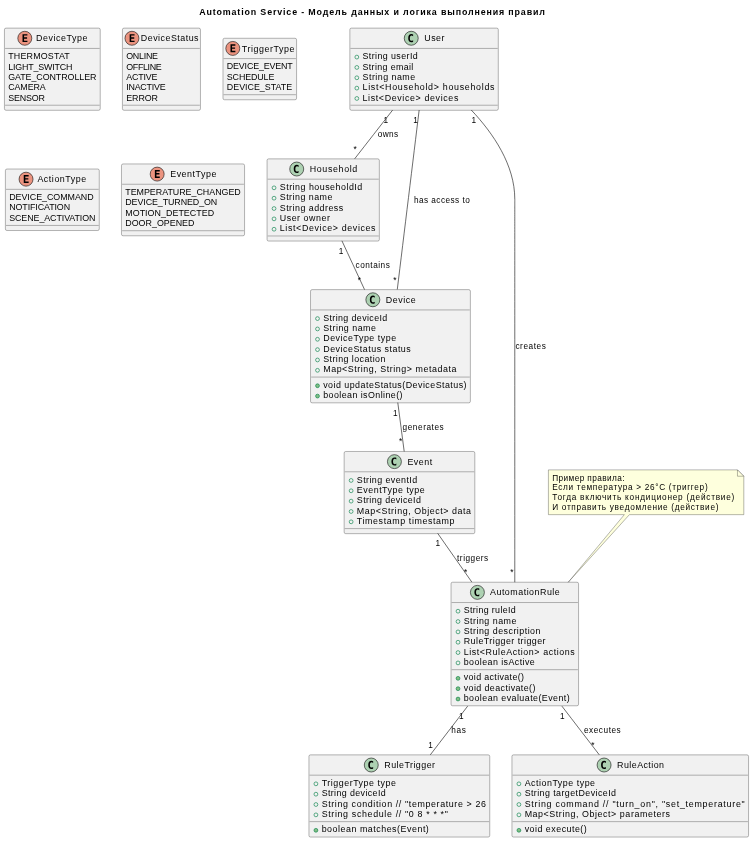
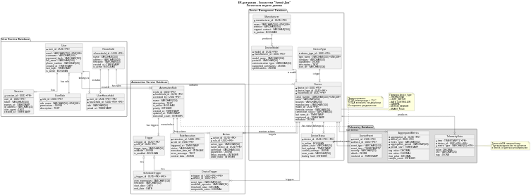

# Project_template

Это шаблон для решения проектной работы. Структура этого файла повторяет структуру заданий. Заполняйте его по мере работы над решением.

# Задание 1. Анализ и планирование

<aside>

Чтобы составить документ с описанием текущей архитектуры приложения, можно часть информации взять из описания компании и условия задания. Это нормально.

</aside

### 1. Описание функциональности монолитного приложения

**Управление отоплением:**

- Пользователи могут удалённо включать и выключать отопление в своих домах через веб-интерфейс.
- Система поддерживает отправку управляющих команд (on/off) на модули управления отоплением, установленные в домах пользователей.
- Все операции выполняются в синхронном режиме.

**Мониторинг температуры:**

- Пользователи могут просматривать текущую температуру в своих домах через веб-интерфейс.
- Система поддерживает опрос датчиков температуры для получения актуальных данных.
- Данные о температуре получаются через прямой синхронный запрос от сервера к датчику.

### 2. Анализ архитектуры монолитного приложения

Основные особенности текущего приложения:
- **Язык программирования:** Golang
- **База данных:** PostgreSQL. Используется для хранения данных пользователей, устройств (модулей отопления) и показаний температуры.
- **Архитектура:** Монолитная. Веб-сервер, бизнес-логика (управление устройствами, обработка телеметрии), слой доступа к данным и внешние вызовы к устройствам скомпонованы в единое приложение.
- **Взаимодействие:** Полностью синхронное. Запросы от пользователей и к устройствам обрабатываются последовательно. Отсутствуют асинхронные механизмы (очереди, event-driven).
- **Масштабируемость:** Ограничена. Монолит можно масштабировать только вертикально (увеличением ресурсов сервера) или путём запуска полных копий приложения, что неэффективно для отдельных нагруженных функций.
- **Развертывание:** Любое обновление требует остановки всего приложения, что приводит к простою всех сервисов для всех пользователей.
- **Подключение устройств:** Не самообслуживание. Требуется выезд специалиста для физического подключения и настройки устройств к системе.

### 3. Определение доменов и границы контекстов

На основе целевых требований к экосистеме можно выделить следующие ключевые домены и их границы:
1. **Домен "Управление Устройствами" (Core Domain):**
	- **Сущность:** Устройство (Device). Абстракция для физического прибора (датчик температуры, реле света, контроллер ворот, камера).
	- **Контекст:** Регистрация устройства, привязка к пользователю и дому, управление состоянием устройства (on/off, настройки), получение базовой телеметрии (статус, онлайн/оффлайн). Это центральный домен для SaaS-платформы самообслуживания.
2. **Домен "Телеметрия и Мониторинг" (Supporting Domain):**
	- **Сущность:** Показание (Reading), Событие (Event).
	- **Контекст:** Сбор, агрегация, хранение и предоставление истории данных с устройств (температура, потребление энергии, статус движения для камер). Отделение этого контекста позволяет эффективно работать с большими потоками данных.
3. **Домен "Пользователи и Безопасность" (Generic Domain):**
	- **Сущность:** Пользователь (User), Дом (Household), Роль (Role).
	- **Контекст:** Регистрация, аутентификация, авторизация, управление профилями и организация доступа к устройствам и данным.
4. **Домен "Сценарии и Автоматизация" (Core Domain):**
	- **Сущность:** Сценарий (Automation Rule), Триггер (Trigger), Действие (Action).
	- **Контекст:** Позволяет пользователям программировать логику взаимодействия устройств (например, если температура ниже 20°C - включи отопление).
5. **Домен "Интеграция с Внешними Устройствами" (Supporting Domain):**
	- **Контекст:** Адаптация различных протоколов связи (MQTT, Zigbee, HTTP API партнёров) к внутренней модели домена "Управление Устройствами". Позволяет поддерживать устройства разных производителей.

В текущем монолите домены "Управление Устройствами" (только отопление) и "Телеметрия" (только температура) сильно переплетены и не имеют чётких границ.

### **4. Проблемы монолитного решения**

- **Сложность масштабирования.** Невозможно независимо масштабировать ресурсоёмкие части системы (например, сбор телеметрии) без масштабирования всего приложения.
- **Барьер для развития.** Внедрение поддержки новых типов устройств (свет, ворота, камеры) требует модификации и перекомпиляции всей кодовой базы, что повышает риски и замедляет разработку.
- **Низкая отказоустойчивость.** Ошибка в одном модуле (например, в драйвере работы с датчиком температуры) может привести к падению всего сервиса, включая критичное управление отоплением.
- **Длительные циклы развертывания.** Любое мелкое изменение требует полного тестирования и развертывания монолита, что увеличивает time-to-market.
- **Технологический стек зафиксирован.** Сложно применять оптимальные технологии для разных задач (например, временные ряды для телеметрии, графовые БД для сценариев) в рамках одного приложения на Go с PostgreSQL.
- **Отсутствие самообслуживания.** Текущая архитектура с синхронным управлением "сервер-устройство" и необходимостью ручной регистрации специалистом не соответствует целевой модели SaaS.

### 5. Визуализация контекста системы — диаграмма С4

Диаграмма контекста (Context Diagram C4) для текущего монолитного приложения "Тёплый дом".


[Ссылка на исходный код UML](schemas/As-Is_Context_Diagram_C4.puml)

#### Пояснение к диаграмме
Диаграмма показывает текущее состояние (As-Is). Все взаимодействия проходят через единое монолитное приложение. Пользователь и специалист общаются с ним через веб-интерфейс. Монолит, в свою очередь, напрямую и синхронно взаимодействует с каждым устройством в домах и с единственной базой данных. Устройства не общаются друг с другом, а только отвечают на запросы сервера.


# Задание 2. Проектирование микросервисной архитектуры

В этом задании вам нужно предоставить только диаграммы в модели C4. Мы не просим вас отдельно описывать получившиеся микросервисы и то, как вы определили взаимодействия между компонентами To-Be системы. Если вы правильно подготовите диаграммы C4, они и так это покажут.

### Архитектурные решения
На основе DDD-доменов, выделенных в задании 1, спроектирована следующая микросервисная архитектура:
#### Выделенные микросервисы (To-Be):
1. `device-management-service` (Core Domain) - управление устройствами.
2. `telemetry-service` (Supporting Domain) - сбор и хранение телеметрии.
3. `automation-service` (Core Domain) - сценарии и автоматизация.
4. `gateway-service` (Supporting Domain) - адаптация протоколов устройств.
5. `user-service` (Generic Domain) - управление пользователями и безопасность.
6. `api-gateway` - единая точка входа для клиентов.
#### Ключевые технологические решения:
- **Message Broker (Kafka)** - для асинхронного взаимодействия между сервисами.
- **API Gateway** - для маршрутизации запросов, аутентификации и rate limiting.
- **Специализированные БД** - PostgreSQL для транзакционных данных, TimescaleDB для телеметрии.

**Диаграмма контейнеров (Containers)**


[Ссылка на исходный код UML](schemas/To-Be_Container_Diagram_C4.puml)

**Диаграмма компонентов (Components)**

1. Микросервис **Device Management Service**

[Ссылка на исходный код UML](schemas/Device_Management_Components_C4.puml)
2. Микросервис **Telemetry Service**

[Ссылка на исходный код UML](schemas/Telemetry_Components_C4.puml)
3. Микросервис **Automation Service**

[Ссылка на исходный код UML](schemas/Automation_Components_C4.puml)

**Диаграмма кода (Code)**


[Ссылка на исходный код UML](schemas/Automation_Code_Diagram.puml)

# Задание 3. Разработка ER-диаграммы

### Проектирование модели данных
На основе выделенных микросервисов и требований предметной области разработана следующая ER-модель:
#### Ключевые принципы
1. **Разделение ответственности** - данные распределены между специализированными БД.
2. **Гибкость** - поддержка различных типов устройств и сценариев.
3. **Масштабируемость** - оптимизированные структуры для разных типов данных.
#### Основные сущности и их назначение
1. **Пользователи и доступы** (User Service) - управление аккаунтами и правами доступа.
2. **Устройства и дома** (Device Management) - регистрация и состояние оборудования.
3. **Телеметрия** (Telemetry Service) - хранение временных рядов данных.
4. **Сценарии** (Automation Service) - правила автоматизации и их выполнение.

### ER-диаграмма - логическая модель данных.


[Ссылка на исходный код UML](schemas/ER_Diagram.puml)

#### Описание сущностей и связей
1. User Service Database (Сущности управления пользователями):
	- **User** - профиль пользователя системы.
	- **Household** - дом/квартира пользователя (может быть несколько).
	- **UserRole** - роли пользователей (owner, member, guest).
	- **Session** - активные сессии пользователей.
2. Device Management Database (Сущности управления устройствами):
	- **Device** - зарегистрированное физическое устройство.
	- **DeviceType** - тип устройства (термостат, свет, камера, датчик).
	- **DeviceModel** - модель устройства от производителя.
	- **DeviceStatus** - текущее состояние устройства.
3. Automation Service Database (Сущности автоматизации):
	- **AutomationRule** - правило автоматизации.
	- **Trigger** - условие срабатывания правила.
	- **Action** - действие, выполняемое при срабатывании.
	- **RuleExecution** - история выполнения правил.
4. Телеметрия (отдельная БД TimescaleDB):
	- **TelemetryData** - потоковые данные с устройств.
	- **AggregatedMetrics** - агрегированные метрики.

##### Типы связей:
- 1:1 (Один к одному) - например, Device ↔ DeviceStatus
- 1:N (Один ко многим) - User → Household, Household → Device
- N:M (Многие ко многим) - User ↔ Household через UserHousehold
- Наследование - Trigger ← ScheduleTrigger, DeviceTrigger

# Задание 4. Создание и документирование API

### 1. Тип API

Для системы "Умный дом" компании "Тёплый дом" я буду использовать гибридный/комбинированный подход: **REST API + AsyncAPI (Event-driven)**.

1. **REST API (OpenAPI/Swagger)** - для **синхронного взаимодействия**, где требуется немедленный ответ:
	- Управление ресурсами (CRUD операций).
	- Запросы состояния и конфигураций.
	- Действия пользователя (включить/выключить).
	- Аутентификация и авторизация.
2. **AsyncAPI** - для **асинхронного взаимодействия**, где важны события и потоковая обработка:
	- Телеметрия с устройств (высокочастотные данные).
	- События устройств (датчики, триггеры).
	- Выполнение автоматических сценариев.
	- Командная шина для устройств.

#### Обоснование:
- **REST API** идеален для управления сущностями (устройства, пользователи, сценарии), где важна атомарность и немедленный ответ.
- **AsyncAPI** через **Kafka** обеспечивает масштабируемость обработки потоковых данных, отказоустойчивость и слабую связанность сервисов.
- **gRPC** используется для внутренней коммуникации между микросервисами для высокой производительности.

### 2. Документация API

**Структура документации:**
- `api-documentation/openapi/` - спецификации OpenAPI для REST API.
- `api-documentation/asyncapi/` - спецификации AsyncAPI для событий.
- `api-documentation/postman/` - коллекции Postman для тестирования.
- `api-documentation/examples/` - примеры запросов и ответов.

# Задание 5. Работа с docker и docker-compose

### Выполненные задачи:
1. Реализация temperature-api на Go:
	- Использовано приложение `temperature-api` на языке Go.
	- При запросе `/temperature?location=` возвращает случайное значение температуры в диапазоне 18-28°C.
	- Реализована логика маппинга между **location** и **sensorID** согласно требованиям:
		- Living Room - sensor ID "1"
		- Bedroom - sensor ID "2"
		- Kitchen - sensor ID "3"
	- Приложение работает на порту 8081.
2. Docker контейнеризация:
	- Использован `Dockerfile` для temperature-api с multi-stage сборкой.
	- Приложение упаковано в минимальный Alpine образ.
	- Порт 8081 экспонирован по умолчанию.
3. Настройка docker-compose:
	- Добавлен сервис `temperature-api` с портом 8081.
	- Настроен сервис PostgreSQL с инициализационным скриптом `./smart_home/init.sql`
	- Определены зависимости между сервисами.
	- Добавлен healthcheck для PostgreSQL.
	- Настроена общая сеть `smarthome-network`.

### Запуск и тестирование:
1. Запуск всей системы:
```
cd apps
sudo docker compose up --build -d
```
2. Проверка работы temperature-api:
```
curl "http://localhost:8081/temperature?location=Living%20Room"
# Ответ: {"value":23.45,"unit":"°C","timestamp":"...","location":"Living Room",...}
```
3. Тестирование через Postman:
	- Используйте коллекцию `smarthome-api.postman_collection.json`
	- Выполните запросы:
		1. **Create Sensor** - создание датчика температуры.
		2. **Get All Sensors** - получение списка датчиков с актуальной температурой.

	При каждом вызове **Get All Sensors** будет отображаться новое случайное значение температуры.

# **Задание 6. Разработка MVP**

Необходимо создать новые микросервисы и обеспечить их интеграции с существующим монолитом для плавного перехода к микросервисной архитектуре. 

### **Что нужно сделать**

1. Создайте новые микросервисы для управления телеметрией и устройствами (с простейшей логикой), которые будут интегрированы с существующим монолитным приложением. Каждый микросервис на своем ООП языке.
2. Обеспечьте взаимодействие между микросервисами и монолитом (при желании с помощью брокера сообщений), чтобы постепенно перенести функциональность из монолита в микросервисы. 

В результате у вас должны быть созданы Dockerfiles и docker-compose для запуска микросервисов. 